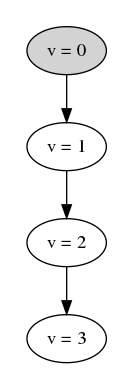

# INCREMENTER

## ISSUE

It seems that changes made by one processor are not seen my the other processor. 

### CASE 1 (single proc)

```incrementer.cfg
SPECIFICATION Spec
CONSTANT Debug      = TRUE
CONSTANT Proc       = {p1}
CONSTANT MaxValue   = 10
INVARIANTS
    Invariants
CONSTRAINTS
    ClockConstraint
```

Running this shows a single thread incrementing the single variable `v` monotonically, as we would expect:

```bash
$ tlc incrementer.tla 
TLC2 Version 2.14 of 10 July 2019 (rev: 0cae24f)

(...)

Computing initial states...
Finished computing initial states: 1 distinct state generated at 2020-04-20 12:29:39.
"Proc[p1] v = 0"
"Proc[p1] v = 1"
"Proc[p1] v = 2"
"Proc[p1] v = 3"
"Proc[p1] v = 4"
"Proc[p1] v = 5"
"Proc[p1] v = 6"
"Proc[p1] v = 7"
"Proc[p1] v = 8"
"Proc[p1] v = 9"
"Proc[p1] v = 10"
Model checking completed. No error has been found.

(...)

```

### CASE 2 (two procs)

```incrementer.cfg
SPECIFICATION Spec
CONSTANT Debug      = TRUE
CONSTANT Proc       = {p1, p2}
CONSTANT MaxValue   = 10
INVARIANTS
    Invariants
CONSTRAINTS
    ClockConstraint
```

Running this shows what _seems_ to be two separate threads incrementing a variable, monotonically, but separately...


```bash
$ tlc incrementer.tla

TLC2 Version 2.14 of 10 July 2019 (rev: 0cae24f)
Running breadth-first search Model-Checking with fp 17 and seed -6108814598051602586 with 1 worker on 8 cores with 7134MB heap and 64MB offheap memory [pid: 20023] (Linux 4.15.0-96-generic amd64, Ubuntu 11.0.6 x86_64, MSBDiskFPSet, DiskStateQueue).

(...) 

Finished computing initial states: 1 distinct state generated at 2020-04-20 12:35:00.
"Proc[p1] v = 0"
"Proc[p2] v = 0"
"Proc[p1] v = 1"
"Proc[p2] v = 1"
"Proc[p1] v = 2"
"Proc[p2] v = 2"
"Proc[p1] v = 3"
"Proc[p2] v = 3"
"Proc[p1] v = 4"
"Proc[p2] v = 4"
"Proc[p1] v = 5"
"Proc[p2] v = 5"
"Proc[p1] v = 6"
"Proc[p2] v = 6"
"Proc[p1] v = 7"
"Proc[p2] v = 7"
"Proc[p1] v = 8"
"Proc[p2] v = 8"
"Proc[p1] v = 9"
"Proc[p2] v = 9"
"Proc[p1] v = 10"
"Proc[p2] v = 10"
Model checking completed. No error has been found.

(...)

```

### QUESTIONS

* Q: Is there really just one instance of the `v` variable here?
* Q: Is this output some artifact of how PrintT works? Note: I tried moving the print into the `Increment` action, and the output is the same:

```tla+
Increment(p) ==
    /\ v' = v + 1
    /\ PrintT("Proc[" \o ToString(p) \o "] v = " \o ToString(v) \o " to v' = " \o ToString(v'))
```

* Q: From my reading of SpecifyingSystems (page 16), paraphrase, an action is any formula involving primed and unprimed variables. I guess my confusion is w/respect to this... I thought that every action describeda unique point in time. To put it another way, the conjuncts of all the state changes within a given action happen at the same point in time, and are by definition, 'atomic'. It seems that I am misunderstanding something, because if my logic were true, then I would not see p1 and p2 both incrementing from N to N+1 as shown here.


### ANSWERS

#### Overview

    from:	Markus Kuppe <tlaplus-google-group@lemmster.de>
    reply-to:	tlaplus@googlegroups.com
    to:	tlaplus@googlegroups.com
    date:	20 Apr 2020, 15:39

    Hi Todd,

    don't use Print or PrintT unless you are familiar with the inner
    workings of TLC.  To visualize the state space of your model, run TLC
    with "-dump dot foo.dot" and render the output ("foo.dot") with GraphViz
    [1].  By the way, the Toolbox has built-in support to visualize state
    spaces.

    Markus

    [1] https://www.graphviz.org/

#### Thoughts

Cool, so it seems that my understanding of `action` is correct.

Per Markus' suggestion, I removed the `PrintT` statements. Here is the
updated code:

```tla+
------------------------------ MODULE incrementer  ------------------------------
EXTENDS TLC
PT == INSTANCE PT
LOCAL INSTANCE FiniteSets
LOCAL INSTANCE Sequences
LOCAL INSTANCE Naturals

CONSTANT Debug                  \* if true then print debug stuff
CONSTANT Proc                   \* set of processors
CONSTANT MaxValue               \* maximum value to increment to

ASSUME DType        == Debug \in {TRUE, FALSE}
ASSUME MVType       == MaxValue \in Nat
ASSUME ProcType     == Cardinality(Proc) > 0

VARIABLES 
    v                           \* the single global variable that is 
                                \* being incremented

vars == << v >>

TypeOK == 
    /\ v \in Nat

Invariants == 
    /\ TypeOK

Init == 
    /\ v = 0

Increment(p) == 
    /\ v' = v + 1

ClockConstraint ==
    /\ v <= MaxValue

Next == \E p \in Proc : Increment(p)

Spec == Init /\ [][Next]_vars

=============================================================================
\* Modification History
\* Created by Todd
```

I re-ran this with the suggested flag to generate a graph of the state-space:

```bash
tlc -dump dot inc.dot incrementer.tla
...
Computing initial states...
Finished computing initial states: 1 distinct state generated at 2020-04-20 17:15:24.
Model checking completed. No error has been found.
```

After installing graphviz, I generated a PNG by:

```bish
dot -Tpng inc.dot -o inc.png
```

Here's the generated PNG:



This looks exactly as expected. Now that I realize I was digging in a sand
trap, I can get back to work on my logical_clock spec.
