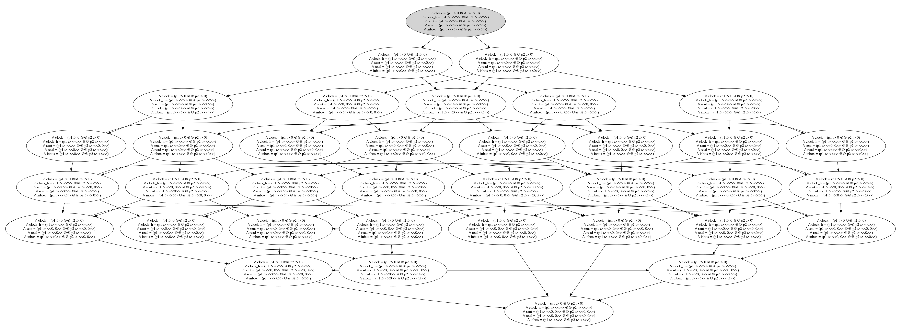

 TLA+ Logical Clock Spec

Adventures in using TLA+ to create a spec for a logical clock, as specified in [GARG](https://www.powells.com/searchresults?keyword=garg+elements+of+distibuted+computing)

## Problem

(See page 31-33)

Verify:

```
\A s <\in S : s -> t => s.c < t.c
```

In my first reading of the algorithm in Figure 3.2 and 3.3, I wasn't sure if this was increment s and then send s, or send s and then set t = s + 1. After reading over this a few times it's clear that it's the latter. I'll go through both of these ideas and see how they play out.

* The [spec is here](./logical_clock.tla).
* The various spec runs are invoked with [this run.sh file](./run.sh).

## Solutions

### Solution1

Pseudocode for WorkerIncrementAndThenSend, wich increments `s` and then sends the increment s to `t`. 

```
    /\ next_clock == clock[self] + 1
    /\ clock' = [clock EXCEPT ![self] = next_clock]
    /\ inbox' = [inbox EXCEPT ![target] = Append(@, next_clock)]
```

The full code for this action is:

```
WorkerIncrementSAndThenSendToT(self) ==
    /\ Cardinality(Proc) > 1
    /\ LET 
            other_clocks == {x \in Proc : x # self}
            next_clock == clock[self] + 1
        IN  
            /\ clock' = [clock EXCEPT ![self] = next_clock]
            /\ clock_h'= [clock_h EXCEPT ![self] = Append(@, next_clock)]
            /\ \E target \in other_clocks : 
                    /\ inbox' = [inbox EXCEPT ![target] = Append(@, next_clock)]
                    /\ sent' = [sent EXCEPT ![self] = Append(@, next_clock)]
            /\ UNCHANGED <<read>>
```

#### S1 : A1 (1 process)

_Increment S, then send incremented S to T_


Update .cfg to run one process:
```
CONSTANT Solution = 1
CONSTANT Proc = { p1 }
CONSTANT MaxValue = 2
CONSTANT MaxSent = 2
```

This generates the following states:


3 distinct states found.

#### S1: B2 (2 processes)

Update .cfg to run two processes:
```
CONSTANT Solution = 1
CONSTANT Proc = { p1, p2 }
CONSTANT MaxValue = 2
CONSTANT MaxSent = 2
```

This generates the following states:


130 distinct states found.


### Solution2

_Send S + 1 to T_ (I'm pretty sure this is the correct interpretation of this algorithm)

The key part of this algorithm is this:

```
    /\ inbox' = [inbox EXCEPT ![target] = Append(@, clock[self] + 1)]
```

The full action is:

```
WorkerSendSToTAndThenIncrement(self) ==
    /\ Cardinality(Proc) > 1
    /\ LET 
            other_clocks == {x \in Proc : x # self}
        IN  
            /\ \E target \in other_clocks : 
                    /\ inbox' = [inbox EXCEPT ![target] = Append(@, clock[self])]
                    /\ sent' = [sent EXCEPT ![self] = Append(@, clock[self])]
            /\ UNCHANGED <<read, clock, clock_h>>
```

#### S2 : A1 (1 process)

```
CONSTANT Solution = 2
CONSTANT Proc = { p1 }
CONSTANT MaxValue = 2
CONSTANT MaxSent = 2
```

This looks identical to Solution 1A.

3 distinct states found.


#### S2 : B2 (2 processes)


```
CONSTANT Solution = 2
CONSTANT Proc = { p1, p2 }
CONSTANT MaxValue = 2
CONSTANT MaxSent = 2
```

1965 distinct states found.


### Solution 3

Take solution 2 and try to limit the state space even further by disabling the internal increment step.

```
CONSTANT Solution = 3
CONSTANT Proc = { p1 }
CONSTANT MaxValue = 2
CONSTANT MaxSent = 2
```

#### S3 : A1 (1 process)

As expected, this deadlocks:

```
Error: Deadlock reached.
Error: The behavior up to this point is:
State 1: <Initial predicate>
/\ clock = (p1 :> 0)
/\ clock_h = (p1 :> <<>>)
/\ sent = (p1 :> <<>>)
/\ read = (p1 :> <<>>)
/\ inbox = (p1 :> <<>>)

1 states generated, 1 distinct states found, 0 states left on queue.
```

#### S3 : A2 (2 processes)

```
CONSTANT Solution = 3
CONSTANT Proc = { p1, p2 }
CONSTANT MaxValue = 2
CONSTANT MaxSent = 2
```

36 distinct states found



### Limiting State Space

* Introduce limits such as MaxValue and MaxSent
* Remove actions if they are not necessary in the common case

I suspect there must be a way to break a spec like this into two parts, one is the spec for the algorithm,
and the other is a `scaffolding` spec to contain all the auxillary stuff needed to fully test the 
algorithm, much like the tests and test harness for production software.

Here's the problem:

```
/\ clock = (p1 :> 0)
/\ clock_h = (p1 :> <<>>)
/\ sent = (p1 :> <<>>)
/\ read = (p1 :> <<>>)
/\ inbox = (p1 :> <<>>)
```

The `sent`, `read`, and `clock_h` variables explode the state space. I'm using
them to reason about the clock.  I suppose I should delete these extra variables
and be more clever about how I reason about the algorithm...and in fact that's
my next step. However, my general question is: Is there an idiomatic way to
separate the stuff we use to verify that an algorithm works the way we want
from the core of the algorithm itself? In this fantasy, I'm imagining that I
put `clock` and `inbox` in SpecA, and put the auxillary stuff into SpecB and
then have a 3rd SpecC that combines the two as a `unit` or `integration` test?.
Or perhaps I'm just thinking like a developer and thinking that application
code and test code should be separate...


## Comments / Email Threads

* https://groups.google.com/d/msg/tlaplus/o26fE2TClIg/_GpPuLsLAwAJ
